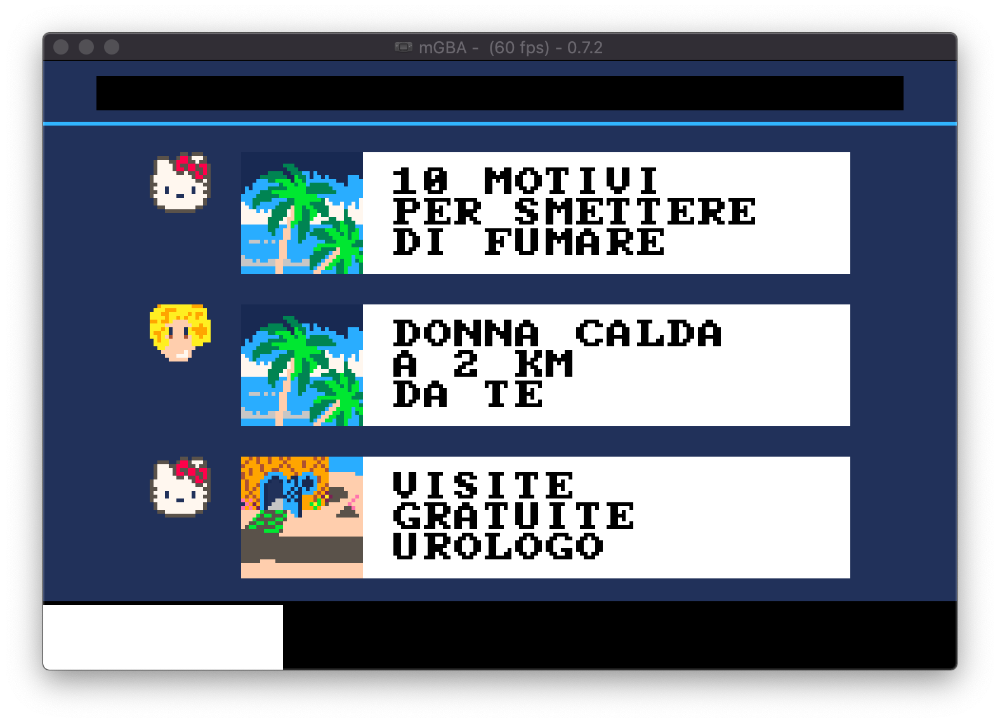

# tambler-gba
A GBA port of a [PICO-8 puzzle game](https://github.com/Pomettini/ggj-2019)

Written in C99, in order to compile the project you need to have [devkitPro](https://devkitpro.org/wiki/Getting_Started) installed

### Special thanks

* [Gbadev](https://www.gbadev.org/) for letting me see the source code of so many GBA projects
* [TONC](https://www.coranac.com/tonc/text/) for writing the best reference manual for the GBA